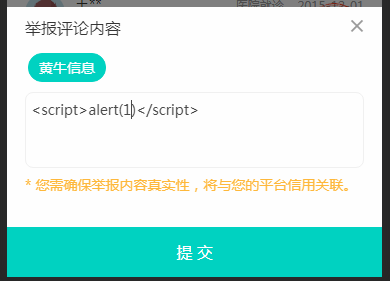
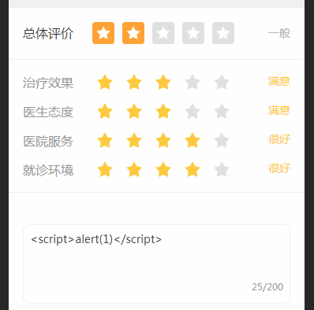

# 前端XSS攻击和防御

**2019年3月初第三方软件扫描我们网站发现安全漏洞，需要紧急修复**

## xss跨站脚本攻击(Cross Site Scripting)

是一种经常出现在web应用中的计算机安全漏洞，指攻击者在网页中嵌入客户端脚本(例如JavaScript), 当用户浏览此网页时，脚本就会在用户的浏览器上执行，从而达到攻击者的目的。比如获取用户的Cookie，导航到恶意网站,携带木马等。

大部分的xss漏洞都是由于没有处理好用户的输入，导致攻击脚本在浏览器中执行，这就是跨站脚本漏洞的根源。

<font color="#f00">XSS 简单点来说，就是攻击者想尽一切办法将可以执行的代码注入到网页中。</font>

## xss攻击类型

总体上分为两类：**持久型和非持久型**。

**1、持久型**

也就是攻击的代码被服务端写入进数据库中，这种攻击危害性很大，因为如果网站访问量很大的话，就会导致大量正常访问页面的用户都受到攻击。

举个例子，对于评论功能来说，就得防范持久型 XSS攻击，因为我可以在评论中输入以下内容




这种情况如果前后端没有做好防御的话，这段评论就会被存储到数据库中，这样每个打开该页面的用户都会被攻击到。

**2、非持久型**

相比于前者危害就小的多了，一般通过**修改 URL 参数**的方式加入攻击代码，诱导用户访问链接从而进行攻击。

举个例子，如果页面需要从 URL 中获取某些参数作为内容的话，不经过过滤就会导致攻击代码被执行
```javascript
<!-- http://www.domain.com?name=<script>alert(1)</script> -->
<div>{{name}}</div>
```

但是对于这种攻击方式来说，如果用户使用 Chrome 这类浏览器的话，浏览器就能自动帮助用户防御攻击。但是我们不能因此就不防御此类攻击了，因为我不能确保用户都使用了该类浏览器。

## 常见的xss攻击方法

1、绕过XSS-Filter，利用<>标签注入Html/JavaScript代码；

2、利用HTML标签的属性值进行xss攻击。例如：``````；（当然并不是所有的Web浏览器都支持Javascript伪协议，所以此类XSS攻击具有一定的局限性）

3、空格、回车和Tab。如果XSS Filter仅仅将敏感的输入字符列入黑名单，比如javascript，用户可以利用空格、回车和Tab键来绕过过滤，例如：```；```

4、利用事件来执行跨站脚本。例如：``````，当src错误的视乎就会执行onerror事件；

5、利用CSS跨站。例如：```Body {backgrund-image: url("javascript:alert('xss')")}；```

6、扰乱过滤规则。例如：```；```

7、利用字符编码，透过这种技巧，不仅能让XSS代码绕过服务端的过滤，还能更好地隐藏Shellcode；（JS支持unicode、eacapes、十六进制、十进制等编码形式）

8、拆分跨站法，将xss攻击的代码拆分开来，适用于应用程序没有过滤 XSS关键字符（如<、>）却对输入字符长度有限制的情况下；

9、DOM型的XSS主要是由客户端的脚本通过DOM动态地输出数据到页面上，它不依赖于提交数据到服务器，而是从客户端获得DOM中的数据在本地执行。容易导致DOM型的XSS的输入源包括：```Document.URL、Location(.pathname|.href|.search|.hash)、

Document.referrer、Window.name、Document.cookie、localStorage/globalStorage；```

## XSS攻击防御

原则：不相信客户输入的数据

注意:  攻击代码不一定在 ```<script></script>``` 中

**1.使用XSS Filter**

输入过滤，对用户提交的数据进行有效性验证，仅接受指定长度范围内并符合我们期望格式的的内容提交，阻止或者忽略除此外的其他任何数据。比如：电话号码必须是数字和中划线组成，而且要设定长度上限。过滤一些些常见的敏感字符，例如：```< > ‘ “ & # \ javascript expression  "onclick="  "onfocus"；```过滤或移除特殊的Html标签， 例如: ```<script>, <iframe> ,  &lt; for <, &gt; for >, &quot for；```过滤JavaScript 事件的标签，例如 ```"onclick=", "onfocus" ```等等。

输出编码，当需要将一个字符串输出到Web网页时，同时又不确定这个字符串中是否包括XSS特殊字符（如```< > &‘”```等），为了确保输出内容的完整性和正确性，可以使用编码（HTMLEncode）进行处理。

**2.DOM型的XSS攻击防御**

把变量输出到页面时要做好相关的编码转义工作，如要输出到 ```<script></script>```中，可以进行JS编码；要输出到HTML内容或属性，则进行HTML编码处理。根据不同的语境采用不同的编码处理方式。

**3.HttpOnly Cookie**

将重要的cookie标记为http only, 这样的话当浏览器向Web服务器发起请求的时就会带上cookie字段，但是在脚本中却不能访问这个cookie，这样就避免了XSS攻击利用JavaScript的document.cookie获取cookie
