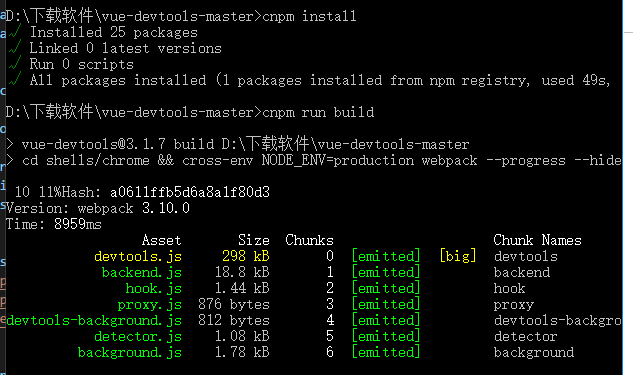
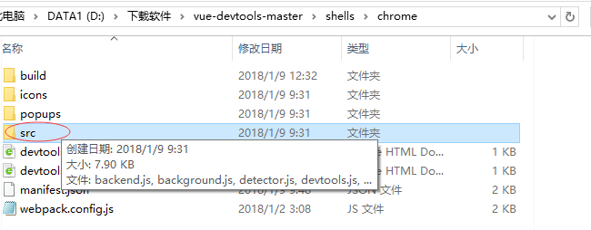
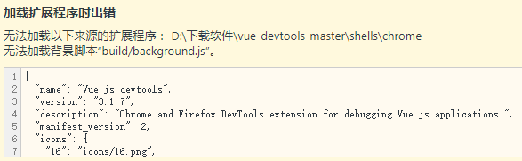
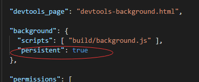
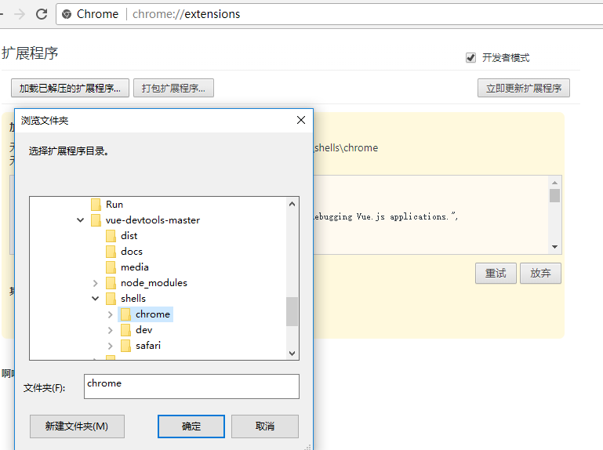
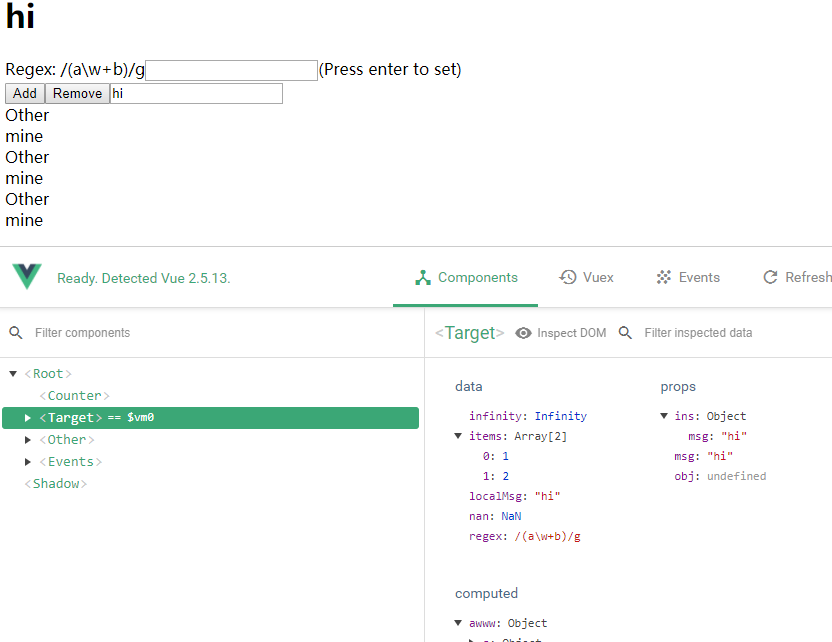

# 我理解的vue
• ```vue```是响应式的，即```JavaScript```代码中变量值的改变会反映到```HTML```元素中，也就是说，实现了数据和视图（```HTML```元素）的绑定。

• 以前的做法：如果要改变```DOM```元素中的内容，我们通常都是使用```JavaScript```提供的```DOM API```，先获取到相应的```DOM```元素，然后进行动态的操作。因为首先要定位到你要修改的```DOM```元素，然后才能修改数据。如果要改动多个元素的话，我们就需要频繁的进行手动```DOM```操作。

• 现在的改变：我们无需关心```DOM```的更新了，只需要改变数据就可以了。因为数据和视图是绑定的，数据的改变会影响到视图，所以```vue```帮我们自动更新了视图。

## 为什么要安装这个插件？

**因为vue是进行数据驱动的，仅仅从chrome浏览器的控制台进行element查看，是看不到数据的动向的。**

# 谷歌浏览器chrome的vuejs devtools 插件的安装
1 . 下载chrome扩展插件。

在github上下载压缩包并解压到本地，github下载地址：```https://github.com/vuejs/vue-devtools```

2. ```npm install```

下载完成后打开命令行cmd进入```vue-devtools-master```文件夹，

1. ```npm install```，安装依赖包；

2. ```npm run build```




```npm run build ```执行完，会在```shells>chrome```下的src文件夹里生产如上图所示的几个js文件；



若不执行以上命令会报错，无法加载背景脚本```"build/background.js"```，如下图：



3. 打开shells>chrome>manifest.json并把json文件里的"persistent":false改成true



4. 扩展chrome插件

1.打开chrome浏览器，打开更多工具>扩展程序；

2.再点击加载已解压的扩展程序，然后把shells>chrome文件夹放入



5， 测试安装成功

在插件的目录下执行npm run dev，这个时候我们的插件就可以运行了,打开localhost:8080可以看到插件已经安装并运行了。

